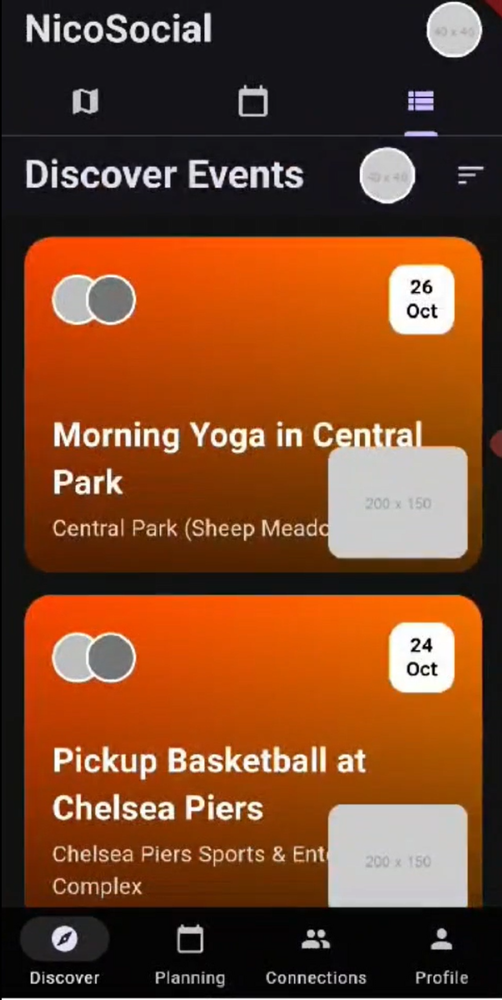

# NicoSocial

[Project Demo Video](https://github.com/user-attachments/assets/d36af9d0-ca59-4abd-8eb3-ef7b52dcafa8)

**NicoSocial** is a social platform designed to make socializing easier, fun, and rewarding by encouraging participation in personalized activities. It connects users through common interests and helps them overcome the initial hurdles of socializing by intelligently recommending events and activities that suit their preferences and social strengths.

The app aims to combat loneliness and improve social interactions using technology, leveraging AI to suggest tailored events and create meaningful connections. 

video: https://drive.google.com/file/d/189nX4sPbv6ksW8MaWGtigZjvtzH0ov17/view?usp=sharing

## Core Features

### 1. **Profiling**
   - Users answer a series of questions to build a social profile. This includes:
     - Basic information.
     - Social experiences and preferences.
     - Social strengths and weaknesses.
     - Interests, cuisine preferences, and more.
   - This data helps the app recommend events tailored to each user’s preferences and strengths, helping them find the best opportunities to socialize.

### 2. **Eventing**
   - An **Event** is defined as an activity that can involve a person or a group of people. The app displays these events with relevant details and participants.
   - **Event Discovery**: Users can view a list of top recommended activities that best match their profile and preferences. They can click on an event to see more details about the activity, the people involved, and any potential rewards (e.g., social points, discounts).
   - **Planning**: The app can also plan activities for users and their friends based on their shared interests.
   - **Encouragement**: By offering discounts and rewards, we encourage users to participate in social activities. We make socializing fun, enjoyable, and rewarding.

### 3. **Connections**
   - Users can add friends on the platform and engage in group activities. The app helps in planning these activities, ensuring they align with everyone’s preferences.

## Addressing Social Challenges

Ever felt lonely at home, unsure how to join social activities? Or watched your friends on social media having fun and wondered how they organize these events? **NicoSocial** helps solve these problems by:
- **Breaking the Ice**: It helps users overcome the hardest part of socializing—initiating conversations and events. AI and algorithms facilitate this by suggesting ways to interact and get involved.
- **Fostering Connections**: The app is designed to make socializing easier by planning activities for you and your friends, so you never feel left out.
  
Technology often gets a bad reputation for making people less social. **NicoSocial** turns that idea around by using tech to help people connect, interact, and make meaningful friendships.

## AI and Event Matchmaking

The app’s event recommendation system is powered by AI, with algorithms working to find the best-suited events for each user. Here’s how it works:
- **Cosine Similarity**: We calculate the similarity between users' profiles and event attributes to recommend the most relevant activities.
- **Gemini API**: This API is integrated into the recommendation logic, helping generate even better matchmaking scores for users and events.
  
I built a demo using HTML to show how the matchmaking works. The demo takes a user’s form input and compares it to a list of sample events, giving each event a score based on how well it matches the user’s preferences. The FastAPI backend handles the similarity calculations and serves these recommendations to the app.

## Current Implementation

Due to time constraints, here’s the current state of the app:

- **Event Map**: A map displaying all ongoing events, shown as pins. Clicking on a pin provides details about that event.
- **Event Calendar**: A calendar that shows all events happening on different days. Clicking a day shows a list of events for that date.
- **Full Events Page**: A page listing all available events. Users can filter and sort events based on various factors, like budget or type of activity, ensuring they find something that fits their needs.
  
The FastAPI backend is integrated to provide event similarity scoring, using AI to help find the most suitable events for each user.

## Screenshots & Demo

- **FastAPI**: Backend server handling similarity logic and event matchmaking.
  <p align="center">
  
</p> 
   video: https://drive.google.com/file/d/1KM_aK7JpsRAc-KzHxPz0866p7gqFmUAX/view?usp=sharing

- HTML Demo: A simple web form demonstrating how event matchmaking works using Cosine Similarity and the Gemini API.
<p align="center">
  
   
</p> 

video: https://drive.google.com/file/d/1CipPKYFsTLHLiHmye-UZ9Z67ePhqky8p/view?usp=sharing


---


## App Screenshots
Below are screenshots from the **NicoSocial** app showcasing key features:

  <p align="center">
    
      
    
  </p>
   <p align="center">
    
   
       
  </p>
  
- **Discover Page**: A list of personalized events recommended for the user.

- **Event Calendar**: View upcoming events in a calendar format, making it easy to schedule activities.

- **Event Details**: Detailed view of an event, showing participants and rewards for joining.


- **Event Map**: A map view displaying ongoing events nearby with clickable pins for details.


- **User Profile**: View and edit user information, social preferences, and interests to improve event recommendations.

- **Full Calendar View**: A broader view of the calendar showing events across multiple dates.


## Tech Stack

- **Frontend**:
  - **Swift**: For iOS app development.
  - **HTML/CSS/JavaScript**: Used for a web demo to demonstrate event matchmaking.
  
- **Backend**:
  - **FastAPI**: Python framework used for handling API requests, event matchmaking logic, and communicating with the Gemini API.

- **Database**:
  - **SQLite/PostgreSQL**: For storing user profiles, events, and matchmaking data.

## How to Run

### Requirements:
- **Xcode**: To run the Swift app on iOS.
- **Python**: Version 3.7+ for the FastAPI backend.
- **FastAPI**: Backend framework to run the event matchmaking logic.

### Steps:

1. **Clone the repository**:
   ```bash
   git clone https://github.com/yourusername/NicoSocial.git
   ```

2. **Backend Setup**:
   - Install dependencies for FastAPI:
     ```bash
     pip install fastapi[all] uvicorn requests
     ```
   - Run the FastAPI backend server:
     ```bash
     uvicorn main:app --reload
     ```

3. **Frontend Setup**:
   - For the Swift app, open the project in Xcode.
   - Ensure the FastAPI server is running to provide event matchmaking API services.
   - For the HTML demo, open `index.html` in a browser to test the event matchmaking proof of concept.
  
## Challenges Faced

Developing **NicoSocial** involved overcoming several major hurdles:

1. **No macOS Device**: One of the biggest obstacles was not having access to a Mac, which made iOS development incredibly challenging. My laptop, despite having decent specs (Intel i5 11th Gen, 16GB RAM, Iris graphics), couldn't run macOS on a virtual machine. Despite trying to borrow a Mac from others, I was unsuccessful.

2. **Jetlag and Academic Load**: While building this app, I was struggling with heavy jetlag and trying to catch up on over 15 days' worth of pending assignments. This made focusing on learning Swift from scratch even harder.

3. **Learning Swift**: I was completely new to Swift, and understanding the language's syntax and quirks, alongside getting familiar with Xcode, was an additional challenge during this period.

Despite these challenges, I pushed through to develop **NicoSocial**. It's not perfect, but it's the best I could achieve under the circumstances.

## Future Improvements

- Full integration of the matchmaking logic in the Swift app.
- Enhancing the event recommendations with more AI models and better user experience.
- Adding media and social features, like sharing events or photos.
  

